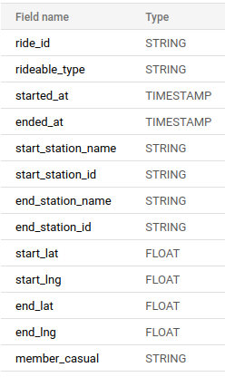

#### Scenario:

You are a junior data analyst working in the marketing analyst team at Cyclistic, a bike-share company in Chicago. The director
of marketing believes the company’s future success depends on maximizing the number of annual memberships. Therefore,
your team wants to understand how casual riders and annual members use Cyclistic bikes differently. From these insights,
your team will design a new marketing strategy to convert casual riders into annual members. But first, Cyclistic executives
must approve your recommendations, so they must be backed up with compelling data insights and professional data
visualizations.

#### Ask
##### Guiding Questions
* What is the problem you are trying to solve?

    The goal is to identify differences in how casual riders and annual members use Cyclistic's bikes in the hopes to get casual rider to become members.
    
* How can your insights drive business decisions?
    
    These insights can be use to increase the number of annual memberships furthering the company's success.
   
#### Prepare
The data has been upload to this folder. The data is ROCCC (reliable, original, comprehensive, current, cited). This is a practice dataset from google 
making it credibile and the data is limited to times and locations so bias don't play much of a role. 
However keeping the overall goal in mind, the data doesn't take into account things like rider's financail needs 
which would play a large role in increasing memberships. 
On the over hand, this data can provide key insights where and for how long the riders use the bikes 
which can lead to key differences in annual member vs casual riders. 

The data contains the following information:

#### Process
All data was upload onto BigQuery and clean by checking for duplicates, missing data, and structural errors like  typos, mislabled categories. 
No errors where found.

Next, I combinded the data to form the following table:
